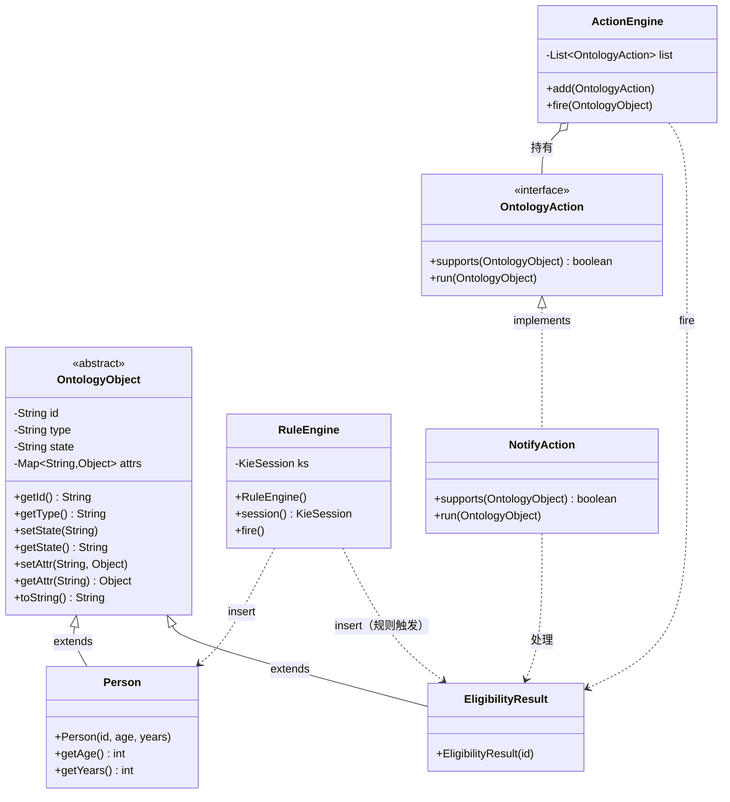
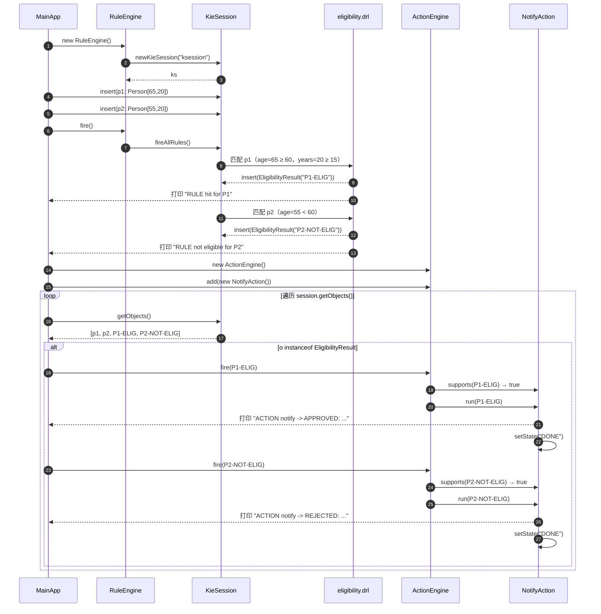

# Mini Ontology Engine — 排障报告

**日期：** 2026-03-02  
**项目：** `com.example:mini-ontology-engine:1.0-SNAPSHOT`  
**运行环境：** Windows / Java 17 / Maven 3.9.11

---

## 一、问题现象

运行 `MainApp` 时连续出现以下错误：

```
SLF4J: Failed to load class "org.slf4j.impl.StaticLoggerBinder".
SLF4J: Defaulting to no-operation (NOP) logger implementation

Exception in thread "main" java.lang.NullPointerException:
  Cannot invoke "org.kie.api.runtime.KieSession.insert(Object)"
  because the return value of "com.example.ontology.RuleEngine.session()" is null
    at com.example.ontology.MainApp.main(MainApp.java:9)
```

---

## 二、根本原因分析

共发现 **4 个独立问题**，按触发顺序排列如下：

### 问题 1 — Drools 版本与 API 不兼容 ⚠️ 主因

| 项目 | 内容 |
|------|------|
| 原版本 | `drools-core / drools-compiler / kie-api: 8.44.0.Final` |
| 代码使用的 API | `KieServices.Factory.get()` → `KieContainer` → `newKieSession("ksession")` |
| 问题 | Drools **8.x 完全移除**了上述经典 API，`newKieSession()` 静默返回 `null` |
| 结果 | `RuleEngine.ks` 字段为 `null`，调用时抛出 `NullPointerException` |

**修复：** 将三个依赖全部降级至 `7.74.1.Final`（最后一个支持经典 API 的稳定版本）

---

### 问题 2 — 缺少 Fat Jar 打包配置

| 项目 | 内容 |
|------|------|
| 表现 | `java.lang.NoClassDefFoundError: org/kie/api/KieServices$Factory` |
| 原因 | `pom.xml` 无任何打包插件，生成的 jar 不含依赖类 |

**修复：** 在 `pom.xml` 中添加 `maven-shade-plugin 3.5.1`，配置合并 `META-INF/kie.conf` 和 `META-INF/kmodule.xml`，排除签名文件（`*.SF / *.DSA / *.RSA`）

---

### 问题 3 — `kmodule.xml` 存放路径错误

| 项目 | 内容 |
|------|------|
| 原路径 | `src/main/resources/kmodule.xml` → 打包后位于 jar 根目录 |
| 正确路径 | `src/main/resources/META-INF/kmodule.xml` → 打包后位于 `META-INF/` |
| 表现 | `[ERROR] Unknown KieSession name: ksession` |
| 原因 | Drools 只扫描 `META-INF/kmodule.xml`，根目录的同名文件不被识别 |

**修复：** 将文件移动至 `src/main/resources/META-INF/kmodule.xml`

---

### 问题 4 — SLF4J 版本与 Drools 7 不兼容

| 项目 | 内容 |
|------|------|
| 原版本 | `slf4j-simple: 2.0.9`（SLF4J 2.x） |
| 问题 | Drools 7 依赖 SLF4J **1.x** 的 `StaticLoggerBinder` 机制；2.x 改用 ServiceLoader，绑定器类不存在 |
| 表现 | `Failed to load class "org.slf4j.impl.StaticLoggerBinder"`，Drools 日志系统初始化异常 |

**修复：** 降级至 `slf4j-simple: 1.7.36`

---

### 问题 5 — 缺少 `drools-mvel` 依赖（规则编译器）

| 项目 | 内容 |
|------|------|
| 表现 | `RuntimeException: You're trying to compile a Drools asset without mvel. Please add org.drools:drools-mvel` |
| 原因 | Drools 7.x 将 MVEL 表达式引擎拆分为独立模块，`.drl` 规则文件编译依赖它 |

**修复：** 添加依赖 `org.drools:drools-mvel:7.74.1.Final`

---

## 三、修改清单

### `pom.xml`

```diff
- <artifactId>drools-core</artifactId>
- <version>8.44.0.Final</version>
+ <version>7.74.1.Final</version>

- <artifactId>drools-compiler</artifactId>
- <version>8.44.0.Final</version>
+ <version>7.74.1.Final</version>

- <artifactId>kie-api</artifactId>
- <version>8.44.0.Final</version>
+ <version>7.74.1.Final</version>

+ <dependency>
+   <groupId>org.drools</groupId>
+   <artifactId>drools-mvel</artifactId>
+   <version>7.74.1.Final</version>
+ </dependency>

- <artifactId>slf4j-simple</artifactId>
- <version>2.0.9</version>
+ <version>1.7.36</version>

+ <build>
+   <plugins>
+     <plugin>maven-shade-plugin 3.5.1（fat jar + 资源合并）</plugin>
+   </plugins>
+ </build>
```

### 文件移动

```
src/main/resources/kmodule.xml
  →  src/main/resources/META-INF/kmodule.xml
```

---

## 四、修复后运行结果

```
[INFO] Found kmodule: jar:file:/...!/META-INF/kmodule.xml
[INFO] Creating KieModule for artifact com.example:mini-ontology-engine:1.0-SNAPSHOT
[INFO] Start creation of KieBase: kbase
[INFO] End creation of KieBase: kbase
RULE hit for P1
ACTION notify -> EligibilityResult(P1-ELIG) state=NEW {}
```

程序正常执行：`Person P1`（年龄 65，工龄 20）满足养老资格规则，触发通知动作。

---

## 五、最终依赖版本

| 依赖 | 版本 |
|------|------|
| `drools-core` | 7.74.1.Final |
| `drools-compiler` | 7.74.1.Final |
| `kie-api` | 7.74.1.Final |
| `drools-mvel` | 7.74.1.Final |
| `slf4j-simple` | 1.7.36 |
| `jgrapht-core` | 1.5.2 |
| `caffeine` | 3.1.8 |
| `maven-shade-plugin` | 3.5.1 |

---

## 六、功能演示 Demo

### 6.1 测试数据

| 人员 | 年龄 | 工龄 | 预期结果 |
|------|------|------|----------|
| P1 | 65 | 20 | ✅ 满足养老条件 |
| P2 | 55 | 20 | ❌ 年龄不足（< 60） |

### 6.2 主程序 `MainApp.java`

```java
package com.example.ontology;

public class MainApp {
  public static void main(String[] args){
    Person p1 = new Person("P1",65,20);
    Person p2 = new Person("P2",55,20);

    RuleEngine re = new RuleEngine();
    re.session().insert(p1);
    re.session().insert(p2);
    re.fire();

    ActionEngine ae = new ActionEngine();
    ae.add(new NotifyAction());

    for(Object o: re.session().getObjects()){
        if(o instanceof EligibilityResult e){
            ae.fire(e);
        }
    }
  }
}
```

### 6.3 规则文件 `eligibility.drl`

```drl
package rules
import com.example.ontology.Person;
import com.example.ontology.EligibilityResult;

rule "pension"
when
  $p: Person( getAge()>=60, getYears()>=15 )
then
  System.out.println("RULE hit for "+$p.getId());
  insert(new EligibilityResult($p.getId()+"-ELIG"));
end

rule "pension-not-eligible"
when
  $p: Person( getAge()<60 || getYears()<15 )
then
  System.out.println("RULE not eligible for "+$p.getId()+" (age="+$p.getAge()+", years="+$p.getYears()+")");
  insert(new EligibilityResult($p.getId()+"-NOT-ELIG"));
end
```

### 6.4 动作实现 `NotifyAction.java`

```java
public class NotifyAction implements OntologyAction {
    public boolean supports(OntologyObject o){
        return o instanceof EligibilityResult;
    }
    public void run(OntologyObject o){
        if(o.getId().endsWith("-NOT-ELIG")){
            System.out.println("ACTION notify -> REJECTED: "+o);
        } else {
            System.out.println("ACTION notify -> APPROVED: "+o);
        }
        o.setState("DONE");
    }
}
```

### 6.5 运行输出

```
RULE hit for P1
RULE not eligible for P2 (age=55, years=20)
ACTION notify -> APPROVED: EligibilityResult(P1-ELIG) state=NEW {}
ACTION notify -> REJECTED: EligibilityResult(P2-NOT-ELIG) state=NEW {}
```

### 6.6 执行流程

```
P1(age=65, years=20) ──→ 命中 "pension" 规则          ──→ 生成 P1-ELIG     ──→ APPROVED ✅
P2(age=55, years=20) ──→ 命中 "pension-not-eligible"  ──→ 生成 P2-NOT-ELIG ──→ REJECTED ❌
```

---

## 七、类图



---

## 八、调用序列图


