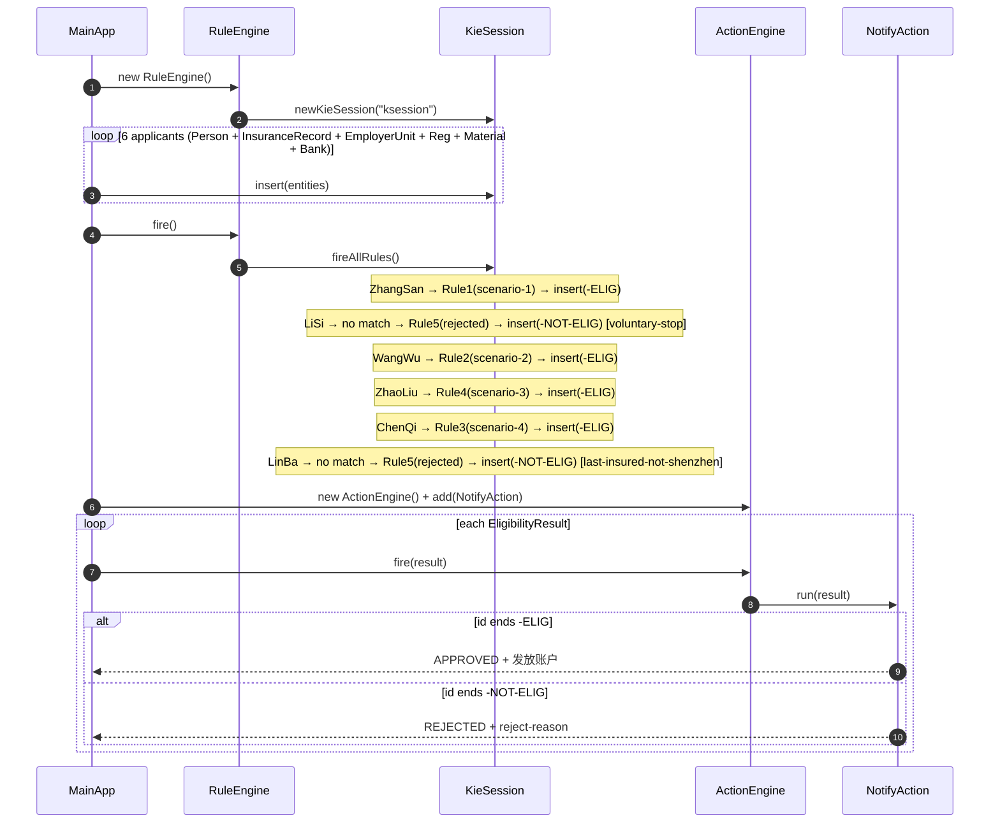

# 失业保险金申领资格审查 — 实现报告

**日期：** 2026-03-03  
**项目：** `com.example:mini-ontology-engine:1.0-SNAPSHOT`  
**运行环境：** Windows / Java 17 / Maven 3.9.11 / Drools 7.74.1.Final

---

## 一、业务背景

依据《深圳市失业保险金申领操作规程》，使用 Drools 规则引擎对以下 4 类申领情形自动进行资格审查（情形五灵活就业暂不在范围内）：

| 情形 | 说明 |
|------|------|
| 情形一 | 单位参保离职人员（缴费 ≥ 12 个月） |
| 情形二 | 单位参保离职人员（缴费 < 12 个月，有剩余领取期限） |
| 情形三 | 离法定退休年龄不足 5 年人员 |
| 情形四 | 个体工商户户主 |

---

## 二、数据模型

### 2.1 实体一览

| 实体类 | 包路径 | 说明 |
|--------|--------|------|
| `UnemployedPerson` | `com.example.ontology.model` | 申请人（姓名、户籍、是否临近退休） |
| `InsuranceRecord` | `com.example.ontology.model` | 参保记录（缴费月数、停保原因、最后参保地） |
| `EmployerUnit` | `com.example.ontology.model` | 用人单位（单位类型，含 23 种 UnitType 枚举） |
| `UnemploymentRegistration` | `com.example.ontology.model` | 失业登记信息（是否已登记、登记日期） |
| `TerminationMaterial` | `com.example.ontology.model` | 劳动关系终止材料（材料类型、终止日期、出具单位） |
| `BankAccount` | `com.example.ontology.model` | 银行账户（不参与规则校验，仅用于发放展示） |
| `EligibilityResult` | `com.example.ontology.model` | 规则引擎产生的审查结论 |

### 2.2 `UnemployedPerson` 字段与构造器

```java
// 4 参数构造器（主构造器）
public UnemployedPerson(String id, String name, boolean domicileShenzhen, boolean nearRetirement)

// 3 参数构造器（委托，nearRetirement 默认 false）
public UnemployedPerson(String id, String name, boolean domicileShenzhen)
```

| 字段 | 类型 | 说明 |
|------|------|------|
| `id` | String | 证件号码（继承自 OntologyObject） |
| `name` | String | 姓名 |
| `domicileShenzhen` | boolean | 户籍地是否为深圳 |
| `nearRetirement` | boolean | 是否临近退休（距法定退休年龄不足 5 年） |

### 2.3 `InsuranceRecord` — StopReason 枚举（15 个值）

| 枚举值 | 含义 | 属于非本人意愿 |
|--------|------|:---:|
| `CONTRACT_EXPIRED` | 劳动合同期满 | ✅ |
| `UNIT_BANKRUPT` | 单位破产 | ✅ |
| `UNIT_ORDERED_CLOSE` | 单位被责令关闭 | ✅ |
| `UNIT_LICENSE_REVOKED` | 单位被吊销营业执照 | ✅ |
| `UNIT_DISSOLVED` | 单位被撤销或提前解散 | ✅ |
| `UNIT_FIRE_FOR_FAULT` | 用人单位因劳动者过错解除 | ✅ |
| `UNIT_ADVANCE_NOTICE` | 用人单位提前通知解除 | ✅ |
| `UNIT_PAY_ONE_MONTH` | 额外支付一个月工资解除 | ✅ |
| `UNIT_LAYOFF_ARTICLE41` | 依劳动合同法第 41 条裁员 | ✅ |
| `MUTUAL_AGREEMENT_UNIT_PROPOSE` | 双方协商一致、单位提出 | ✅ |
| `WORKER_QUIT_FOR_UNIT_FAULT` | 用人单位过错致劳动者解除 | ✅ |
| `PUBLIC_UNIT_TERMINATE` | 事业单位提出解除聘用合同 | ✅ |
| `INDIVIDUAL_UNIT_CLOSED` | 个体工商户注销/吊销/撤销 | ✅ |
| `INDIVIDUAL_STOP_PRODUCTION` | 个体工商户停产停业 | ✅ |
| `VOLUNTARY_RESIGN` | 本人意愿离职 | ❌ |

`meetsPaymentCondition()` = `getPaidMonths() >= 12 || getRemainingMonths() > 0`

### 2.4 `EmployerUnit` — UnitType 枚举（部分关键值）

| 枚举值 | 代码 | 说明 |
|--------|------|------|
| `ENTERPRISE` | 10 | 企业 |
| `INDIVIDUAL_BUSINESS` | 81 | 个体工商户 |
| `PUBLIC_INSTITUTION` | 50 | 事业单位（通用） |
| `PUBLIC_FULL_FUND` | 55 | 全额拨款事业单位 |
| `PUBLIC_PARTIAL_FUND` | 56 | 差额拨款事业单位 |
| `PUBLIC_SELF_FUND` | 57 | 自收自支事业单位 |

`isIndividualBusiness()` = `unitType == INDIVIDUAL_BUSINESS`  
`isPublicInstitution()` = unitType in {50, 55, 56, 57}

### 2.5 `EligibilityResult` 构造器

```java
EligibilityResult(String id)                      // rejectReason = ""
EligibilityResult(String id, String rejectReason) // 拒绝时附带原因
```

id 以 `-ELIG` 结尾表示通过，以 `-NOT-ELIG` 结尾表示拒绝。  
`getRejectReason()` 返回拒绝原因字符串（可为空）。

---

## 三、实体关联关系

所有实体通过 `applicantId == $p.getId()` 在 Drools Working Memory 中进行 join：

```
KieSession Working Memory
  ├── UnemployedPerson          ← 主体事实，规则 when 的核心匹配对象
  ├── InsuranceRecord           ← 缴费条件 / 停保原因 / 最后参保地
  ├── EmployerUnit              ← 单位类型（区分情形一/二/三 vs 情形四）
  ├── UnemploymentRegistration  ← 失业登记状态
  ├── TerminationMaterial       ← 劳动关系终止材料（存在即可）
  └── EligibilityResult         ← 规则 then 块 insert 产生，供 ActionEngine 消费
```

---

## 四、遭遇的 Bug：DRL 中文字符串编码失效

### 4.1 问题现象

初版 DRL 中使用字符串字面量做条件匹配：

```drl
getDomicile() == "深圳"
```

运行后所有申请人全部命中拒绝规则，println 输出乱码：

```
[RULE] 涓嶇鍚堢敵棰嗘潯浠? → 寮犱笁 鍘熷洜: 鎴峰睘闈炴繁鍦?
```

### 4.2 根本原因

| 层次 | 说明 |
|------|------|
| DRL 文件 | 以 UTF-8 保存，字节正确 |
| Fat Jar 打包 | maven-shade-plugin 原样打包，字节未变 |
| JVM 运行时 | Windows 下 JVM 以 GBK 解码 classpath 资源字节流 |
| 最终结果 | DRL 中的 "深圳" 被 GBK 解码为乱码，与 Java 对象中 UTF-8 的 "深圳" 永远不等 |

### 4.3 修复方案

将字符串判断**前移到 Java 构造器**，存为 `boolean`；DRL 条件改为布尔比较，彻底消除 DRL 中的中文字符串。

```diff
- getDomicile() == "深圳"
+ isDomicileShenzhen() == true
```

**原则：DRL 文件中不允许出现任何中文字符串字面量。**

---

## 五、规则实现（unemployment.drl）

### 5.1 辅助函数

判断停保原因是否属于"非本人意愿"

```drl
function boolean isInvoluntaryStop(StopReason reason) {
    switch (reason) {
        case CONTRACT_EXPIRED:
        case UNIT_BANKRUPT:
        case UNIT_ORDERED_CLOSE:
        case UNIT_LICENSE_REVOKED:
        case UNIT_DISSOLVED:
        case UNIT_FIRE_FOR_FAULT:
        case UNIT_ADVANCE_NOTICE:
        case UNIT_PAY_ONE_MONTH:
        case UNIT_LAYOFF_ARTICLE41:
        case MUTUAL_AGREEMENT_UNIT_PROPOSE:
        case WORKER_QUIT_FOR_UNIT_FAULT:
        case PUBLIC_UNIT_TERMINATE:
        case INDIVIDUAL_UNIT_CLOSED:
        case INDIVIDUAL_STOP_PRODUCTION:
            return true;
        default:
            return false;
    }
}
```

### 5.2 规则总览

| 规则名 | 情形 | 关键条件 |
|--------|------|---------|
| `unemployment-benefit-general-employee` | 情形一 | isNearRetirement==false, !individualBusiness, paidMonths>=12, involuntaryStop |
| `unemployment-benefit-short-tenure` | 情形二 | isNearRetirement==false, !individualBusiness, paidMonths<12, remainingMonths>0 |
| `unemployment-benefit-individual-business` | 情形四 | isIndividualBusiness==true, stop in {INDIVIDUAL_UNIT_CLOSED, INDIVIDUAL_STOP_PRODUCTION} |
| `unemployment-benefit-near-retirement` | 情形三 | isNearRetirement==true, !individualBusiness, meetsPaymentCondition==true |
| `unemployment-benefit-rejected` | 兜底 | not EligibilityResult(-ELIG)，构建 reason 字符串 |

> 情形一与情形二均添加 `isNearRetirement() == false` 约束，防止临近退休人员重复命中。

### 5.3 规则一：情形一

```drl
rule "unemployment-benefit-general-employee"
    when
        $p: UnemployedPerson(isDomicileShenzhen() == true, isNearRetirement() == false)
        $ins: InsuranceRecord(
            getApplicantId() == $p.getId(),
            isLastInsuredShenzhen() == true,
            getPaidMonths() >= 12,
            getRemainingMonths() > 0,
            isInvoluntaryStop(getStopReason()) == true
        )
        $unit: EmployerUnit(getApplicantId() == $p.getId(), isIndividualBusiness() == false)
        $reg: UnemploymentRegistration(getApplicantId() == $p.getId(), isRegistered() == true)
        $mat: TerminationMaterial(getApplicantId() == $p.getId())
    then
        System.out.println("[RULE][PASS] scenario-1 general-employee");
        insert(new EligibilityResult($p.getId() + "-ELIG"));
end
```

### 5.4 规则二：情形二

```drl
rule "unemployment-benefit-short-tenure"
    when
        $p: UnemployedPerson(isDomicileShenzhen() == true, isNearRetirement() == false)
        $ins: InsuranceRecord(
            getApplicantId() == $p.getId(),
            isLastInsuredShenzhen() == true,
            getPaidMonths() < 12,
            getRemainingMonths() > 0,
            isInvoluntaryStop(getStopReason()) == true
        )
        $unit: EmployerUnit(getApplicantId() == $p.getId(), isIndividualBusiness() == false)
        $reg: UnemploymentRegistration(getApplicantId() == $p.getId(), isRegistered() == true)
        $mat: TerminationMaterial(getApplicantId() == $p.getId())
    then
        System.out.println("[RULE][PASS] scenario-2 short-tenure");
        insert(new EligibilityResult($p.getId() + "-ELIG"));
end
```

### 5.5 规则三：情形四（个体工商户）

```drl
rule "unemployment-benefit-individual-business"
    when
        $p: UnemployedPerson(isDomicileShenzhen() == true)
        $ins: InsuranceRecord(
            getApplicantId() == $p.getId(),
            isLastInsuredShenzhen() == true,
            meetsPaymentCondition() == true,
            getRemainingMonths() > 0,
            (getStopReason() == StopReason.INDIVIDUAL_UNIT_CLOSED
             || getStopReason() == StopReason.INDIVIDUAL_STOP_PRODUCTION)
        )
        $unit: EmployerUnit(getApplicantId() == $p.getId(), isIndividualBusiness() == true)
        $reg: UnemploymentRegistration(getApplicantId() == $p.getId(), isRegistered() == true)
        $mat: TerminationMaterial(getApplicantId() == $p.getId())
    then
        System.out.println("[RULE][PASS] scenario-4 individual-business");
        insert(new EligibilityResult($p.getId() + "-ELIG"));
end
```

### 5.6 规则四：情形三（临近退休）

```drl
rule "unemployment-benefit-near-retirement"
    when
        $p: UnemployedPerson(isDomicileShenzhen() == true, isNearRetirement() == true)
        $ins: InsuranceRecord(
            getApplicantId() == $p.getId(),
            isLastInsuredShenzhen() == true,
            meetsPaymentCondition() == true,
            getRemainingMonths() > 0,
            isInvoluntaryStop(getStopReason()) == true
        )
        $unit: EmployerUnit(getApplicantId() == $p.getId(), isIndividualBusiness() == false)
        $reg: UnemploymentRegistration(getApplicantId() == $p.getId(), isRegistered() == true)
        $mat: TerminationMaterial(getApplicantId() == $p.getId())
    then
        System.out.println("[RULE][PASS] scenario-3 near-retirement");
        insert(new EligibilityResult($p.getId() + "-ELIG"));
end
```

### 5.7 规则五：兜底拒绝

```drl
rule "unemployment-benefit-rejected"
    when
        $p:   UnemployedPerson()
        $ins: InsuranceRecord(getApplicantId() == $p.getId())
        $unit: EmployerUnit(getApplicantId() == $p.getId())
        $reg: UnemploymentRegistration(getApplicantId() == $p.getId())
        $mat: TerminationMaterial(getApplicantId() == $p.getId())
        not EligibilityResult(getId() == ($p.getId() + "-ELIG"))
    then
        StringBuilder reason = new StringBuilder();
        if (!$p.isDomicileShenzhen())                reason.append("domicile-not-shenzhen; ");
        if (!$ins.isLastInsuredShenzhen())            reason.append("last-insured-not-shenzhen; ");
        if (!$ins.meetsPaymentCondition())            reason.append("insufficient-paid-months; ");
        if ($ins.getRemainingMonths() <= 0)           reason.append("no-remaining-months; ");
        if (!$reg.isRegistered())                     reason.append("registration-invalid; ");
        if (!isInvoluntaryStop($ins.getStopReason())) reason.append("voluntary-stop(" + $ins.getStopReason() + "); ");
        insert(new EligibilityResult($p.getId() + "-NOT-ELIG", reason.toString()));
end
```

---

## 六、测试用例

### 6.1 MainApp 手工测试（6 条）

| # | 姓名 | 情形 | 户籍深圳 | 参保地深圳 | 缴费月 | 剩余月 | 临近退休 | 已登记 | 停保原因 | 期望 | 实际 |
|---|------|------|:---:|:---:|:---:|:---:|:---:|:---:|------|:---:|:---:|
| 1 | ZhangSan | 情形一 | ✅ | ✅ | 36 | 18 | ❌ | ✅ | CONTRACT_EXPIRED | ✅ | ✅ |
| 2 | LiSi | 情形一拒绝 | ✅ | ✅ | 24 | 12 | ❌ | ✅ | VOLUNTARY_RESIGN | ❌ | ❌ |
| 3 | WangWu | 情形二 | ✅ | ✅ | 8 | 4 | ❌ | ✅ | UNIT_LAYOFF_ARTICLE41 | ✅ | ✅ |
| 4 | ZhaoLiu | 情形三 | ✅ | ✅ | 240 | 24 | ✅ | ✅ | CONTRACT_EXPIRED | ✅ | ✅ |
| 5 | ChenQi | 情形四 | ✅ | ✅ | 60 | 12 | ❌ | ✅ | INDIVIDUAL_UNIT_CLOSED | ✅ | ✅ |
| 6 | LinBa | 拒绝 | ✅ | ❌ | 18 | 9 | ❌ | ✅ | CONTRACT_EXPIRED | ❌ | ❌ |

### 6.2 JUnit 5 单元测试（10 条，全部通过）

**文件：** `src/test/java/com/example/ontology/UnemploymentEligibilityTest.java`

| 测试方法 | 场景 | 断言 |
|----------|------|------|
| `scenario1_approved` | 情形一通过 | id 含 `-ELIG`，rejectReason 为空 |
| `scenario1_rejected_voluntaryResign` | 主动辞职拒绝 | id 含 `-NOT-ELIG`，reason 含 `voluntary-stop` |
| `scenario2_approved` | 情形二通过 | id 含 `-ELIG` |
| `scenario2_rejected_noRemainingMonths` | 情形二无剩余月数拒绝 | reason 含 `no-remaining-months` |
| `scenario3_approved` | 情形三通过 | id 含 `-ELIG` |
| `scenario3_rejected_noRegistration` | 情形三未登记拒绝 | reason 含 `registration-invalid` |
| `scenario4_approved_unitClosed` | 情形四注销通过 | id 含 `-ELIG` |
| `scenario4_approved_stopProduction` | 情形四停产通过 | id 含 `-ELIG` |
| `rejected_lastInsuredNotShenzhen` | 最后参保地非深圳 | reason 含 `last-insured-not-shenzhen` |
| `rejected_domicileNotShenzhen` | 户籍非深圳 | reason 含 `domicile-not-shenzhen` |

```
Tests run: 10, Failures: 0, Errors: 0, Skipped: 0  BUILD SUCCESS
```

---

## 七、实际运行输出

```
══════════════════════════════════════
   失业保险金申领资格审查系统  v1.0
══════════════════════════════════════
[PHASE 1] 录入申请人信息

[RULE][PASS] scenario-1 general-employee  → ZhangSan (440101199001011234)
[RULE][PASS] scenario-2 short-tenure      → WangWu   (440101199001013456)
[RULE][PASS] scenario-3 near-retirement   → ZhaoLiu  (440101196501014567)
[RULE][PASS] scenario-4 individual-business → ChenQi (440101198001015678)

[RULE][REJECTED]  LiSi   reason: voluntary-stop(VOLUNTARY_RESIGN);
[RULE][REJECTED]  LinBa  reason: last-insured-not-shenzhen;

══════════════════════════════════════
           审 查 结 论
══════════════════════════════════════
[NOTIFY] APPROVED: 440101199001011234-ELIG
  发放账户 : 中国建设银行 6222021234567890 (ZhangSan)
[NOTIFY] REJECTED: 440101199001012345-NOT-ELIG
  reject-reason: voluntary-stop(VOLUNTARY_RESIGN);
[NOTIFY] APPROVED: 440101199001013456-ELIG
  发放账户 : 中国农业银行 6222025555666677 (WangWu)
[NOTIFY] APPROVED: 440101196501014567-ELIG
  发放账户 : Bank of China 6222021111222233 (ZhaoLiu)
[NOTIFY] APPROVED: 440101198001015678-ELIG
  发放账户 : 招商银行 6222023344556677 (ChenQi)
[NOTIFY] REJECTED: 440101199001016789-NOT-ELIG
  reject-reason: last-insured-not-shenzhen;
```

---

## 八、执行流程图

```
MainApp
  │
  ├─ insertApplicant × 6（每人插入 6 个实体：Person/InsuranceRecord/EmployerUnit/Reg/Material/Bank）
  │
  ├─ RuleEngine.fire()  →  Drools fireAllRules()
  │      │
  │      ├─ ZhangSan → Rule1 命中 (scenario-1) → insert("-ELIG")
  │      ├─ LiSi     → 无规则命中 → Rule5 兜底 → insert("-NOT-ELIG") [voluntary-stop]
  │      ├─ WangWu   → Rule2 命中 (scenario-2) → insert("-ELIG")
  │      ├─ ZhaoLiu  → Rule4 命中 (scenario-3) → insert("-ELIG")
  │      ├─ ChenQi   → Rule3 命中 (scenario-4) → insert("-ELIG")
  │      └─ LinBa    → 无规则命中 → Rule5 兜底 → insert("-NOT-ELIG") [last-insured-not-shenzhen]
  │
  └─ ActionEngine.fire(每个 EligibilityResult)
         └─ NotifyAction → APPROVED + 发放账户 / REJECTED + reject-reason
```

---

## 九、类图

```mermaid
classDiagram
    direction TB

    class OntologyObject["OntologyObject\n本体基类"] {
        <<abstract>>
        -String id
        -String state
        -Map~String,Object~ attrs
        +getId() String
        +setState(String)
        +getAttr(String) Object
    }

    class UnemployedPerson["UnemployedPerson\n申请人"] {
        +isDomicileShenzhen() boolean
        +isNearRetirement() boolean
        +getName() String
    }

    class InsuranceRecord["InsuranceRecord\n失业保险参保记录"] {
        +getApplicantId() String
        +getPaidMonths() int
        +getRemainingMonths() int
        +isLastInsuredShenzhen() boolean
        +getStopReason() StopReason
        +meetsPaymentCondition() boolean
    }

    class EmployerUnit["EmployerUnit\n用人单位"] {
        +getApplicantId() String
        +getUnitType() UnitType
        +isIndividualBusiness() boolean
        +isPublicInstitution() boolean
    }

    class UnemploymentRegistration["UnemploymentRegistration\n失业登记信息"] {
        +getApplicantId() String
        +isRegistered() boolean
        +getRegistrationDate() String
    }

    class TerminationMaterial["TerminationMaterial\n劳动关系终止材料"] {
        +getApplicantId() String
        +getMaterialType() MaterialType
        +getTerminationDate() String
        +getIssuingUnit() String
    }

    class BankAccount["BankAccount\n银行账户"] {
        +getApplicantId() String
        +getAccountNo() String
        +getBankName() String
        +getAccountName() String
    }

    class EligibilityResult["EligibilityResult\n资格审查结论"] {
        +EligibilityResult(id)
        +EligibilityResult(id, rejectReason)
        +getRejectReason() String
    }

    class RuleEngine["RuleEngine\n规则引擎"] {
        -KieSession ks
        +session() KieSession
        +fire()
    }

    class ActionEngine["ActionEngine\n动作引擎"] {
        -List~OntologyAction~ actions
        +add(OntologyAction)
        +fire(OntologyObject)
    }

    class NotifyAction["NotifyAction\n通知动作"] {
        +supports(OntologyObject) boolean
        +run(OntologyObject)
    }

    OntologyObject <|-- UnemployedPerson : extends
    OntologyObject <|-- InsuranceRecord : extends
    OntologyObject <|-- EmployerUnit : extends
    OntologyObject <|-- UnemploymentRegistration : extends
    OntologyObject <|-- TerminationMaterial : extends
    OntologyObject <|-- BankAccount : extends
    OntologyObject <|-- EligibilityResult : extends

    UnemployedPerson "1" --> "1" InsuranceRecord : 参保关联\napplicantId = id
    UnemployedPerson "1" --> "1" EmployerUnit : 单位关联\napplicantId = id
    UnemployedPerson "1" --> "1" UnemploymentRegistration : 登记关联\napplicantId = id
    UnemployedPerson "1" --> "0..*" TerminationMaterial : 材料关联\napplicantId = id
    UnemployedPerson "1" --> "0..1" BankAccount : 账户关联\napplicantId = id
    UnemployedPerson "1" --> "0..1" EligibilityResult : 审查结论\nid + -ELIG/-NOT-ELIG

    ActionEngine o-- NotifyAction : 持有
    ActionEngine ..> EligibilityResult : fire 消费
    RuleEngine ..> EligibilityResult : insert 产生
```



---

## 十、序列图


